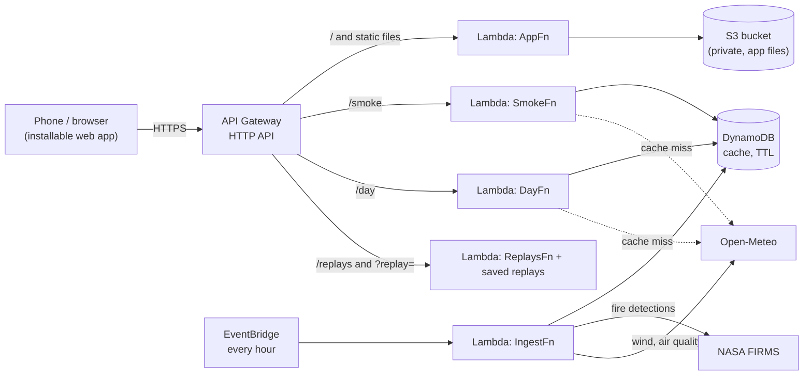

# Whiff architecture

Whiff tells you when smoke is coming: it combines NASA satellite fire detections with wind forecasts to estimate when smoke from burning will reach a location in India, and plans the day around clean-air hours. Everything runs on AWS serverless services.

## 1. Diagram

Request path: the app loads from S3 through AppFn. It calls `/smoke` and `/day`, which answer from DynamoDB when the entry is fresh. The hourly ingest keeps the cache warm for the configured cities, so most requests make no outside calls.

## 2. AWS services and what each does here
- **API Gateway (HTTP API):** the single public HTTPS address. Routes `/smoke`, `/day`, `/history`, `/replays`, and everything else goes to the app. CORS is on.
- **Lambda (Python 3.12), six functions:** `SmokeFn` and `DayFn` compute the answers; `ReplaysFn` lists saved past events; `HistoryFn` (placeholder, see section 7); `AppFn` serves the app from S3; `IngestFn` is the hourly job.
- **EventBridge:** a schedule rule runs `IngestFn` every hour.
- **DynamoDB (on-demand):** stores the fire clusters (`fires#latest`, compressed), per-location results and air-quality series. Each item has a fresh-until time and a later cleanup time, so an expired copy can still be served as "stale" if a source is down.
- **S3 (private bucket):** holds the built app files. Not public.
- **SAM / CloudFormation:** the whole stack is one template (`infra/template.yaml`).
- Not used: CloudFront. A new AWS account must be verified by AWS Support before it may create CloudFront distributions, so the app is served through API Gateway and Lambda instead.

## 3. Data sources and credits
- **NASA FIRMS** (VIIRS active-fire detections; S-NPP, NOAA-20, and NOAA-21 for live data). Replays use the standard-processing archive, which has S-NPP and NOAA-20 only.
- **Open-Meteo** wind forecast (10 m and 850 hPa), historical wind archive, and air-quality data from the CAMS global model (about 45 km resolution, modelled, not station readings). Free tier is non-commercial. CC BY 4.0.
- **CPCB daily bulletins and IITM stubble-share estimates**, as collected by Person B in `docs/validation-events.md`, are the independent evidence for the past events.
- Fonts, libraries and licences are credited in `CREDITS.md`.

## 4. How the smoke logic works, and its limits
This is a transparent heuristic, not a dispersion model.
1. Every hour, India's fire detections from the last 48 hours are grouped into 0.25 degree cells. Detections of nominal or high confidence only.
2. For a location, fire cells within 700 km that lie upwind are kept (the wind must carry air from the fire toward the location, within about 60 degrees). Wind is the average of the 10 m and 850 hPa winds at the location over the next 24 hours.
3. Travel time is distance divided by the wind speed along the route. Anything over 48 hours is dropped. A slow wind means too slow, so no warning.
4. Score = fires in the last 24 hours, weighted by closeness and alignment. Risk is none below 40, low from 40, medium from 75, high from 200. These were calibrated on past events (section 5).
5. Arrival time is the score-weighted median travel time, with a range from the 25th to 75th percentile. Confidence goes up or down with wind steadiness, trend in fires, arrival time and data age.

Limits: wind is taken at the user's location only (not along the route); no terrain, mixing height, chemistry or rain; all fire detections count, including non-crop fires (brick kilns, industry); region labels use rough boxes; "crop residue likely" is a label for fires in Punjab, Haryana and west UP during October and November, never a certainty. Hourly AQI for the day plan is an estimate from the modelled PM2.5 and PM10.

## 5. Validation results
<!-- validation:start -->
| Event | As-of | Predicted risk | Predicted arrival | Confidence | Actual jump (how found) | Lead if warned | Hit? |
|---|---|---|---|---|---|---|---|
| delhi-2024-10 | 48 h before (Oct 21 12:00) | none | - | medium | Oct 23 12:00 (CPCB date) | | |
| delhi-2024-10 | 36 h before (Oct 22 00:00) | none | - | medium | Oct 23 12:00 (CPCB date) | | |
| delhi-2024-10 | 24 h before (Oct 22 12:00) | none | - | medium | Oct 23 12:00 (CPCB date) | | |
| delhi-2024-10 | 12 h before (Oct 23 00:00) | medium | 40 h | low | Oct 23 12:00 (CPCB date) | | |
| **delhi-2024-10** | **verdict** | | | | | 12 h | **HIT** |
| delhi-2024-11 | 48 h before (Nov 11 12:00) | none | - | medium | Nov 13 12:00 (CPCB date) | | |
| delhi-2024-11 | 36 h before (Nov 12 00:00) | low | 38 h | low | Nov 13 12:00 (CPCB date) | | |
| delhi-2024-11 | 24 h before (Nov 12 12:00) | high | 37 h | low | Nov 13 12:00 (CPCB date) | | |
| delhi-2024-11 | 12 h before (Nov 13 00:00) | low | 29 h | medium | Nov 13 12:00 (CPCB date) | | |
| **delhi-2024-11** | **verdict** | | | | | 24 h | **HIT** |
| lucknow-2023-11 | 48 h before (Nov 02 12:00) | medium | 37 h | low | Nov 04 12:00 (CPCB date) | | |
| lucknow-2023-11 | 36 h before (Nov 03 00:00) | low | 38 h | low | Nov 04 12:00 (CPCB date) | | |
| lucknow-2023-11 | 24 h before (Nov 03 12:00) | low | 35 h | medium | Nov 04 12:00 (CPCB date) | | |
| lucknow-2023-11 | 12 h before (Nov 04 00:00) | low | 35 h | medium | Nov 04 12:00 (CPCB date) | | |
| **lucknow-2023-11** | **verdict** | | | | | 48 h | **HIT** |
| delhi-2024-10-calm | Oct 04 06:00 | none | - | medium | no spike (calm) | - | correct |
| delhi-2024-10-calm | Oct 05 06:00 | none | - | medium | no spike (calm) | - | correct |
| delhi-2024-10-calm | Oct 06 06:00 | none | - | medium | no spike (calm) | - | correct |
| delhi-2024-10-calm | Oct 07 06:00 | low | 31 | medium | no spike (calm) | - | correct |
| delhi-2024-10-calm | Oct 08 06:00 | low | 34 | medium | no spike (calm) | - | correct |
| delhi-2024-10-calm | Oct 09 06:00 | low | 23 | high | no spike (calm) | - | correct |
| delhi-2024-10-calm | Oct 10 06:00 | medium | 45 | low | no spike (calm) | - | FALSE ALARM |
| delhi-2024-10-calm | Oct 11 06:00 | none | - | high | no spike (calm) | - | correct |

- delhi-2024-10: HIT, warned 12 h ahead
- delhi-2024-11: HIT, warned 24 h ahead
- lucknow-2023-11: HIT, warned 48 h ahead
- delhi-2024-10-calm: 1 false alarm(s) in 8 calm mornings

Caveats: archived wind is reanalysis, not a forecast (replays are slightly easier than real life); CAMS is a ~45 km model with 3-hourly steps; very small sample.
<!-- validation:end -->

How it was tested: for each past event, the same code was run "as of" 48, 36, 24 and 12 hours before the spike, hiding any fire detection newer than 3 hours before that moment. A **hit** means a medium or high warning at least 12 hours ahead. The calm week (Delhi, 4 to 11 October 2024, inside fire season) checks false alarms. Thresholds were tuned on three events plus the calm week; two further events were held out and never used for tuning.

Honest caveats:
- Very small sample: three events and one calm week. This is calibration, not proof of accuracy.
- Archived wind is real (reanalysis) wind, not the forecast that existed at the time, so replays are slightly easier than live use.
- CAMS under-reads Delhi's worst days (daily means near 100 to 155 µg/m³ when CPCB reported 450 to 590 in mid-November 2024) and shows no clear jump in October 2024, so events are graded against the CPCB-reported spike days.
- The Lucknow event has weak evidence (the report does not name smoke) and is a limitation example.
- A "hit" means the warning came before a bad day, not that smoke caused it. Calm wind, dust, traffic and firecrackers also drive Delhi's worst days.

## 6. Data coverage
<!-- coverage:start -->
| City | Wind ok? | PM2.5 ok? | Notes |
|---|---|---|---|
| Delhi | yes | yes | - |
| Lucknow | yes | yes | - |
| Chandigarh | yes | yes | - |
| Bengaluru | yes | yes | - |
| Chennai | yes | yes | - |
<!-- coverage:end -->

## 7. What we did not build
- **Real `/history` (worst day and likely cause):** the endpoint still returns a sample. No screen depends on it, so nothing in the app should claim it.
- **Festival awareness:** the festival flag exists in the code, but the list of verified firecracker nights is empty, so it never fires. We do not claim festival detection.
- **Activity verification** for the streak (steps, wearables), WhatsApp or SMS alerts, accounts, and AI-written alert text (Bedrock).
- **Wind along the route**, a dispersion model, or official PM2.5 station data as the live source.
- **CloudFront**, for the account-verification reason above.
- Notification pushes in the background are simulated in the demo; replay mode is a demo aid and is always labelled "replay of a past event".
